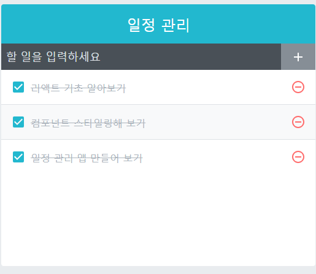
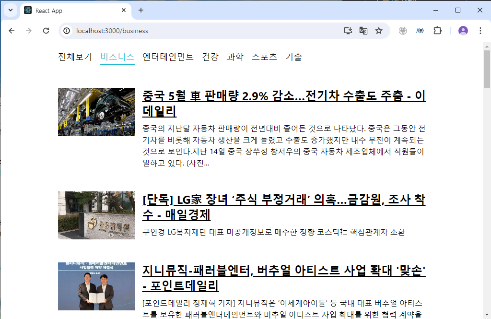

# React

길벗의 리액트를 다루는 기술을 보고 학습을 기록합니다.

##### 6월 10일
- 1장 리액트 시작 학습 및 정리
- 2장 JSX 학습 및 정리

##### 6월 11일
- 3장 컴포넌트 학습 및 정리
- 4장 이벤트 핸들링 학습 및 정리

##### 6월 12일
- 5장 ref:DOM에 이름 달기 학습 및 정리
- 6장 컴포넌트 반복 학습 및 정리

##### 6월 13일
- 7장 컴포넌트의 라이프사이클 메서드 학습 및 정리
- 8장 Hooks 학습 및 정리

##### 6월 14일
- 9장 컴포넌트 스타일링 학습 및 정리
- 10장 일정 관리 웹 애플리케이션 만들기
    - todo 웹 애플리케이션 프로젝트
    
    

##### 6월 15일
- 11장 컴포넌트 성능 최적화 학습 및 정리
- 12장 immer를 사용하여 더 쉽게 불변성 유지하기 학습 및 정리

##### 6월 17일
- 13장 리액트 라우터로 SPA 개발하기 학습 및 정리
- 14장 외부 API를 연동하여 뉴스 뷰어 만들기
    - 최신 뉴스 목록을 보여주는 프로젝트
    

##### 6월 18일
- 15장 Context API 학습 및 정리
- 16장 리덕스 라이브러리 이해하기 학습 및 정리

##### 6월 19일 
- 17장 리덕스를 사용하여 리액트 애플리케이션 상태 관리하기 학습 및 정리

##### 6월 20일
- 18장 리덕스 미들웨어를 통한 비동기 작업 관리 학습 및 정리